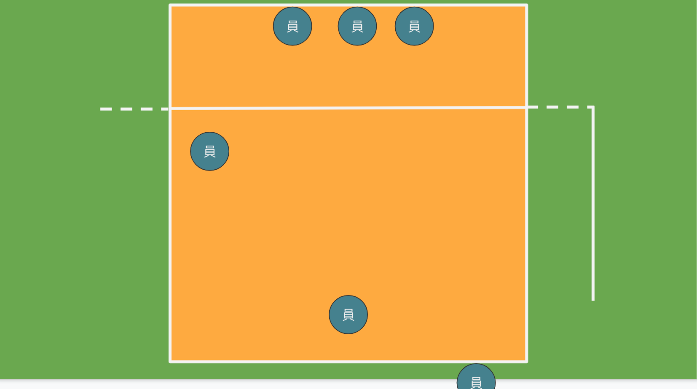
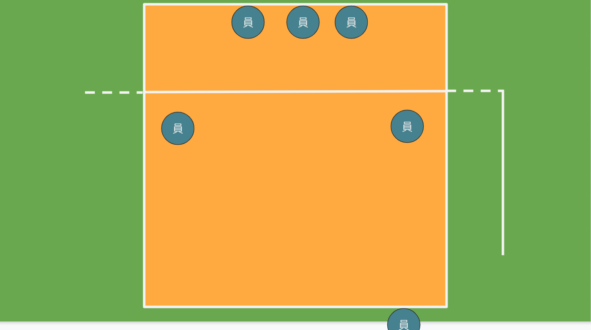
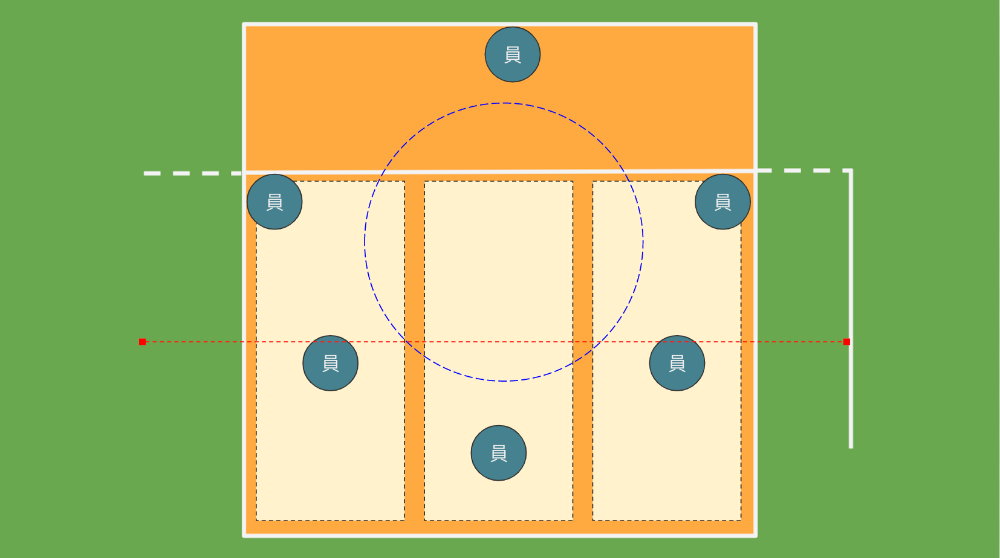
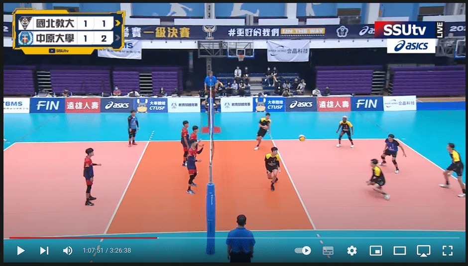
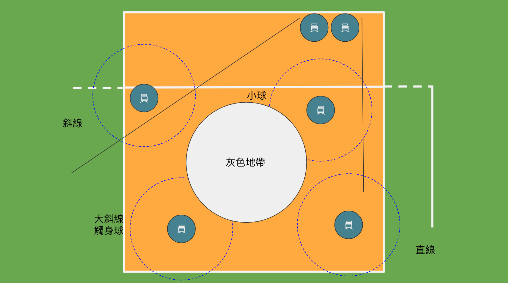

## 輪轉位置

### 你沒有發現的地上號碼

通常我們在打排球的時候，都會有順時間輪轉的情況，每當死球交換球權的時候，就是輪轉的時候，所以地上的號碼是以發球的順序來定義號碼的，這個號碼也是方便教練和球員之前的溝通，如下圖。

### 前後左右的觀念

前後左右的相對應關係，只和你有鄰近的兩個球員有關係，不會受到其它的球員的影響

## 基礎站位觀念

### 發球站位

發球是擁有主動的攻擊的機會，對方也不會有攔網者，因此是一個非常好的得分方式，之後會提到發球的得分技巧和心理戰術。發完球後馬上會面對到的是敵方的攻擊，所以我方需要在最快的時間作好防守位置，所以理想上面所有的球員在一開始就要站在防守位置，如下圖

可以看看到前排的守備球員已在網前預備欄網，後方的球員已預備好進行接扣防守，發球的人員也會馬上到 `1號位` 前面進行防守，但會發氣前方其實有好大的一個空缺，如果對方在第一時間直接把球打回來，便會增加防守的困難度，因此也可以變成下圖

### 接發站位

主要會使用後排三位 `1號位` `5號位` `6號位` 的選手進行接發，會呈現 `v字型` 前排的選手則預備一些小掉球，主力在使用後排選手接球。後方的接球選手主要會把後場分成三個區域，各自負責一區，另為藍色虛線的部分，算是發球的小球，由左邊右邊 `1號位` `5號位` 的選手來接小球。接發的選手會站在 `7m ~ 8m` 的位置，主要原是接球的過程中，前進容易後退難，所以接發的過程中，會在後面的地方接發。

> 只由三位選手接發，是為了未來更複雜的排球戰術預備，此時不會用位置來選擇接發選手，會主要以主攻和自由球員來進行接發。

[參考網址](https://www.youtube.com/watch?v=AlOj01XM6AE)

在後方的接發呈現一個 V 字形。

### 基礎防守

防守是需全隊的連結性強的時候，才會發出大量的防守能量。

#### 防守站位

前排的防守球員會有兩個人主力去作欄網，另一個人會來接斜線，後排的三位球員格別負責小球、直線、大斜線、觸身球、中間的灰色地帶主要會是欄網者去負責。驅動像這樣子的防守隊形是要由欄網者決定，如果欄網沒有定位，剩下的防守者也會沒有辦法好好的預備防守。

#### 接扣選手的視角

防守是由欄網者觸發，所以接扣者也會因此而調整位子，如果當你蹲低看著前方，如果只有看到手而沒有看到球，恭喜你很安全，因為不會有任何的球打到你的身上，但我們是防守者，所以應該是要去找球會打到那裡，因此需移動身子去推測球會掉落在何處。下圖防守者不應該在欄網者的正後方，會沒有球打。

### 基礎進攻觀念

#### 攻擊面積

什麼是攻擊面積？？防守者最好是希望透過攔網可直接擋住，無需要透過後方的球員，所以**攔網是最有效力的防守方式**，所以攻擊者如何避開攔網者是一個很重要的課題。

好首先打點高，直接從攔網者的手上面打過去，這是每一個人的夢想，但是真的是一個夢想，通常不容易實現。好的那高低不行的話，那就左右吧。網寬有 9M 如果這個寬度都可以是攻擊的範圍那該有多好，所以慢慢就有了三個攻擊手的方式來欺騙攔網者。讓前方的攔網者平凡的跑動，他們累了也就出現攻擊機會了。所以為了增加攻擊面積也衍生出許多的攻擊模式。

在來我們來討論一下攻擊的編碼，這裡的編碼和前面提到的位子上的編碼是完全不一樣的東西，請不要搞混在一起，每個球隊的編碼也都要有所不同，所以只要隊伍上面溝通好就可以了，下列提出本身常用的攻擊編碼

**缺圖**

#### 為什麼教練愛左撇子

人們總是物以稀為貴，認識的人中左撇子本身人數就不多，所以能遇到左手的攻擊者，都是非常寶貴的。不過也是要攻擊打的穩，不然就算是左撇子也沒有什麼用處，下面列出他們的優勢

1. 人數較少，本身的攻擊路徑不容易被習慣，攔網者不易掌握球的路徑
2. 適合打副舉的位置，可以增攻面積

#### 團隊進攻 & 攻擊站位

進攻本是一個團隊的事情，並不是二傳把球舉出去就讓攻擊手自行去處理剩下的所有事情。

## 連結性

上面的這所此有的理討論聽起來都很完全，但是球場如戰場，所以遇到的事情不會總是按自己想像的情況來發生，所以異常處理的情況是非常的重要，

### 狀況球的處理

### 團隊默契

## 總結

球員的場上表現需要磨練四個重要的技能

1. **個人體能**：
   * 說了這麼的多，不如一個力氣大，有體力的人一直轟炸你的球隊，所以體能力氣是一很重的事情，常常會有人問說為什麼我發球都發不過去呢？是不是我的技巧那裡沒有掌握好呢？但常常就是，你的力氣太小了，結束…
2. **各人戰技**：
   * 自己本身的接發、接扣、攻擊、舉球的質量如果也到了一個水平的話，是可以幫助團體穩住節奏

3. **團隊默契**：
   * 團隊中的連結性越好的情況，能互相幫忙處理狀況球，激發出不同的防守和攻擊模式

4. **心理素質**：
   *  在面對強大的對手時，應要如何去面對
   *  在 24 分的壓力下發球，應要如何去面對
   *  在團隊中失誤頻傳的情況下，如何穩住軍心

