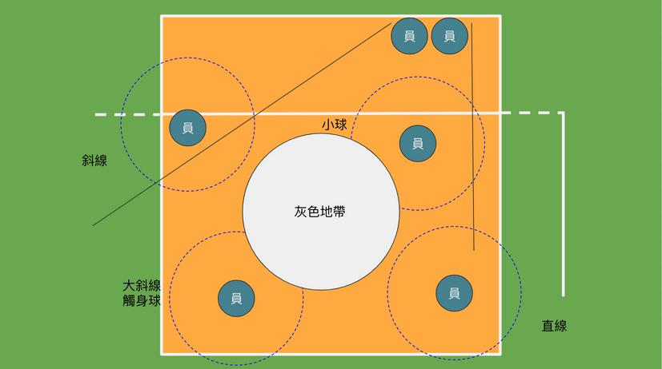

## 輪轉位置

### 你沒有看到的號碼

### 前後左右的觀念

## 基礎站位觀念

### 發球站位

發球是擁有主動的攻擊的機會，對方也不會有攔網者，因此是一個非常好的得分方式，之後會提到發球的得分技巧和心理戰術。發完球後馬上會面對到的是敵方的攻擊，所以我方需要在最快的時間作好防守位置，所以理想上面所有的球員在一開始就要站在防守位置，如下圖

可以看看到前排的守備球員已在網前預備欄網，後方的球員已預備好進行接扣防守，發球的人員也會馬上到 `1號位` 前面進行防守，但會發氣前方其實有好大的一個空缺，如果對方在第一時間直接把球打回來，便會增加防守的困難度，因此也可以變成下圖

### 接發站位

主要會使用後排三位 `1號位` `5號位` `6號位` 的選手進行接發，會呈現 `v字型` 前排的選手則預備一些小掉球，主力在使用後排選手接球。後方的接球選手主要會把後場分成三個區域，各自負責一區，另為藍色虛線的部分，算是發球的小球，由左邊右邊 `1號位` `5號位` 的選手來接小球。接發的選手會站在 `7m ~ 8m` 的位置，主要原是接球的過程中，前進容易後退難，所以接發的過程中，會在後面的地方接發。

> 只由三位選手接發，是為了未來更複雜的排球戰術預備，此時不會用位置來選擇接發選手，會主要以主攻和自由球員來進行接發。

### 基礎防守

防守是需全隊的連結性強的時候，才會發出大量的防守能量。

#### 防守站位

前排的防守球員會有兩個人主力去作欄網，另一個人會來接斜線，後排的三位球員格別負責小球、直線、大斜線、觸身球、中間的灰色地帶主要會是欄網者去負責。驅動像這樣子的防守隊形是要由欄網者決定，如果欄網沒有定位，剩下的防守者也會沒有辦法好好的預備防守。

#### 接扣選手的視角

防守是由欄網者觸發，所以接扣者也會因此而調整位子，如果當你蹲低看著前方，如果只有看到手而沒有看到球，恭喜你很安全，因為不會有任何的球打到你的身上，但我們是防守者，所以應該是要去找球會打到那裡，因此需移動身子去推測球會掉落在何處。下圖防守者不應該在欄網者的正後方，會沒有球打。

### 基礎進攻觀念

#### 為什麼教練愛左撇子

#### 團隊進攻
