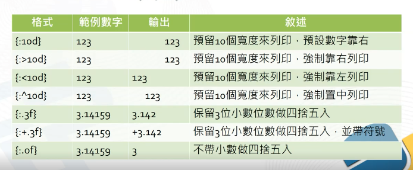
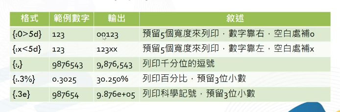
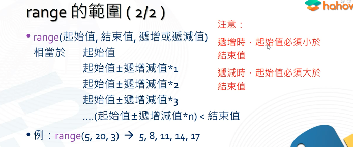

## chapter-6

基本程式設計(二)

```python
height = eval(input('enter your heigth:')) 
weigth = eval(input('enter your weigth:'))

bmi = weigth/((height/100)**2)
print('your is', bmi ,'!!!')
```

```python
tempC = eval(input('input Celsius temperature：'))

tempF = tempC * (9/5) + 32
print('Celsius temperature', tempC , '= tempF', tempF)
```


## chapter-7

基本程式設計(二)

```python
intA = 5
intB = 3

result = '{0} * {1} = {2}'.format(intA,intB,intA*intB)
print(result) # 5 * 3 = 15
```



> d = digital

```python
intD = 5 
print('number{:^5d}'.format(intD)) # number  5  
```



```python
intD = 12300
print('number {:,}'.format(intD)) # number 12,300
```


## chapter-8

基本程式設計(三)

座標距離設計

```python
x1 = eval(input('enter A point x coordinate'))
y1 = eval(input('enter A point y coordinate'))
x2 = eval(input('enter B point x coordinate'))
y2 = eval(input('enter B point y coordinate'))


distance = ((x1-x2)**2+(y1-y2)**2)**0.5
print('A coordinate is ( {}, {} )'.format(x1,x2))
print('B coordinate is ( {}, {} )'.format(y1,y2))
print('distance is {:.4f}'.format(distance))
```


## chapter-9

選擇敘述 if 

```python
score = eval(input('your score ？'))
if score > 80: 
  print('over 80')
elif score > 60:
  print('ok, fine !!')
else:
  print('less 80')
```


## chapter-10

for loop 



```python
for i in range(13,8,-1):
  print(i)
# 13
# 12
# 11
# 10
# 9
```

```python
for i in range(1,7):
  print("@"*i)
# @
# @@
# @@@
# @@@@
# @@@@@
# @@@@@@
```

可以練習寫出一個 9 * 9 乘法表

```python
# bla... bla...
```

## Chapter-11

for loop (二)

