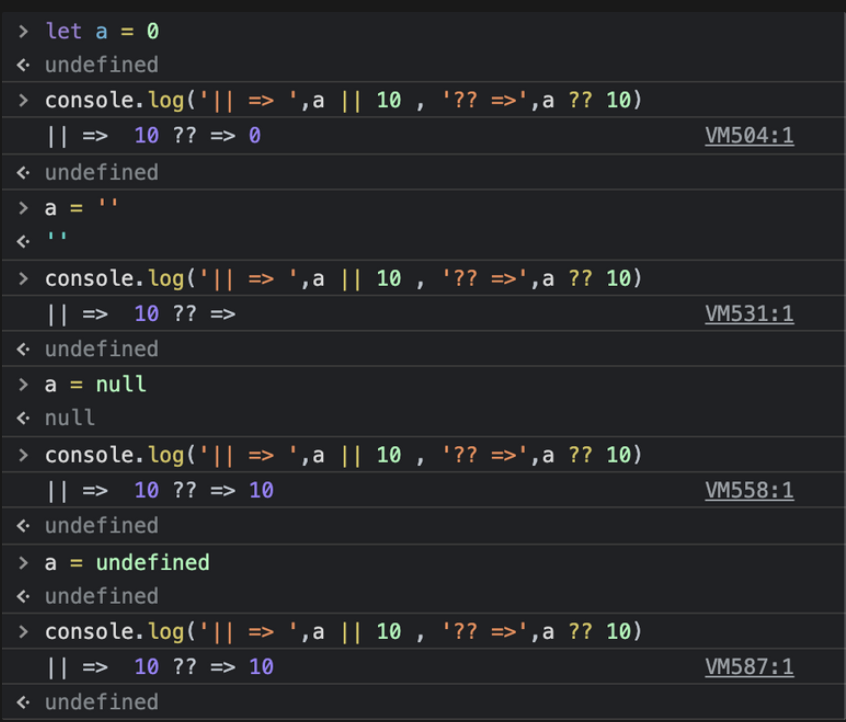

## || 和 ?? 的比較



```jsx
a || 10, a ?? 10;
```

[Node.firstChild - Web APIs | MDN](https://developer.mozilla.org/en-US/docs/Web/API/Node/firstChild)

## decodeURI()

[decodeURI() - JavaScript | MDN](https://developer.mozilla.org/en-US/docs/Web/JavaScript/Reference/Global_Objects/decodeURI)

## Object.entries

```jsx
const object1 = {
    a: "somestring",
    b: 42,
};

for (const [key, value] of Object.entries(object1)) {
    console.log(`${key}: ${value}`);
}

// expected output:
// "a: somestring"
// "b: 42"
```
